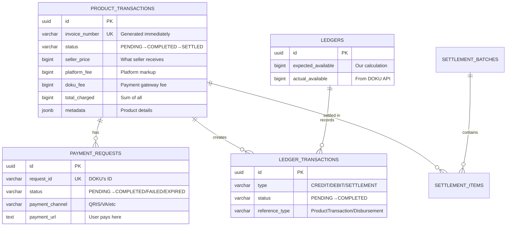
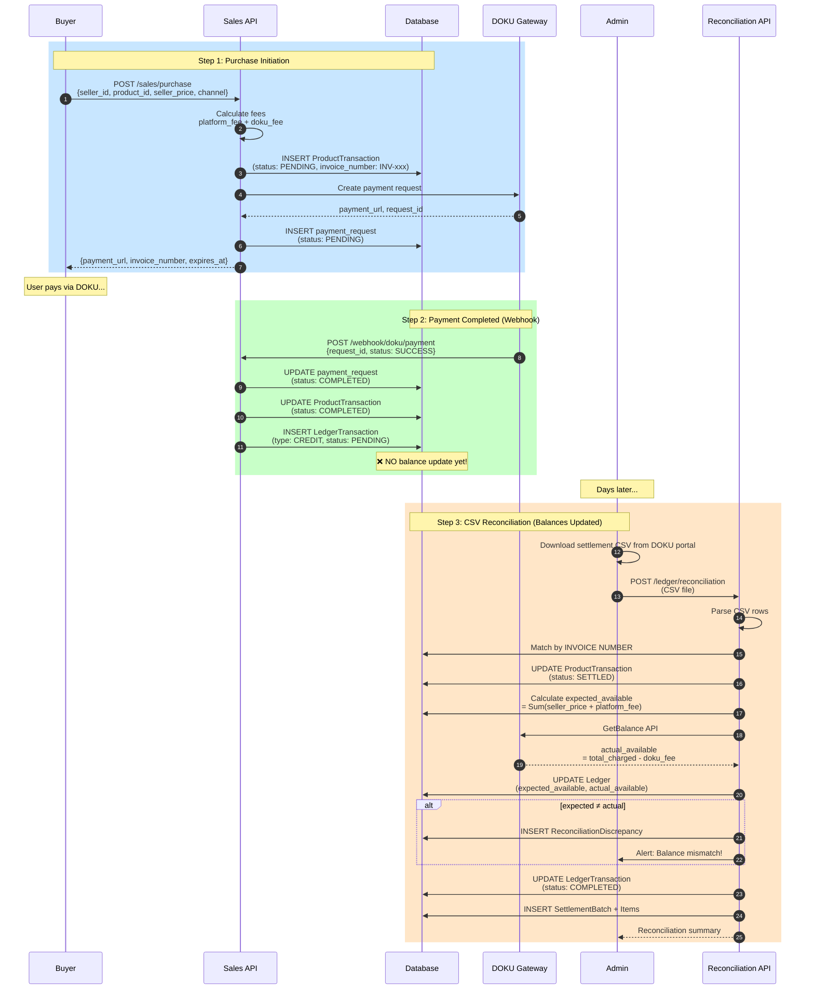
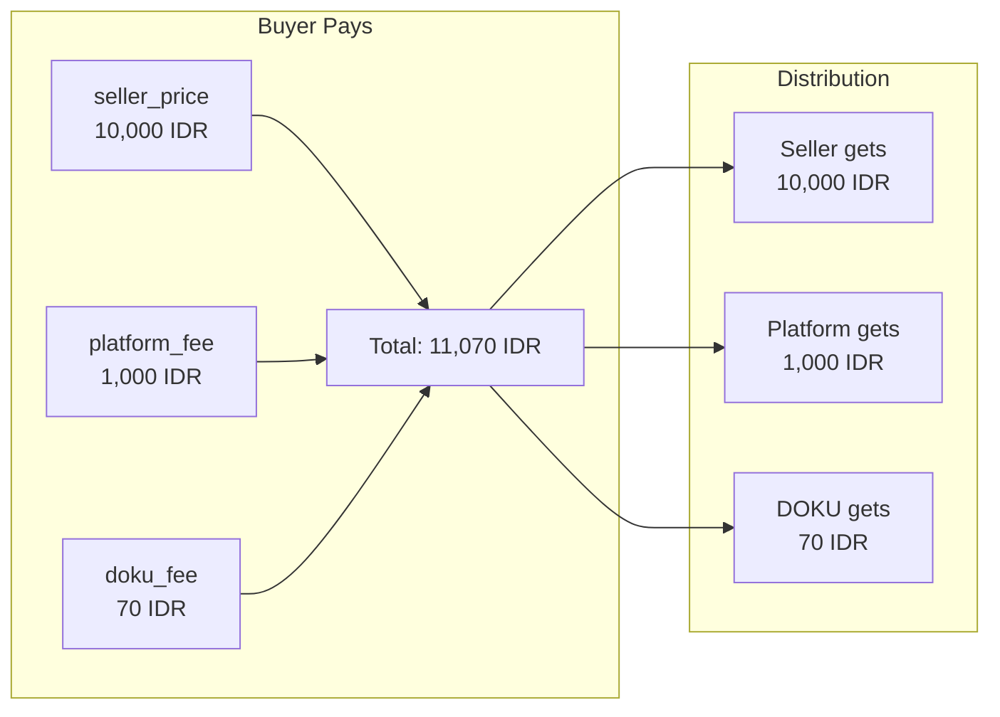
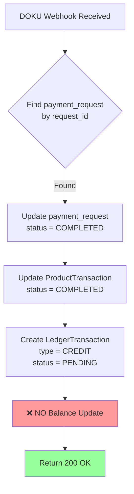
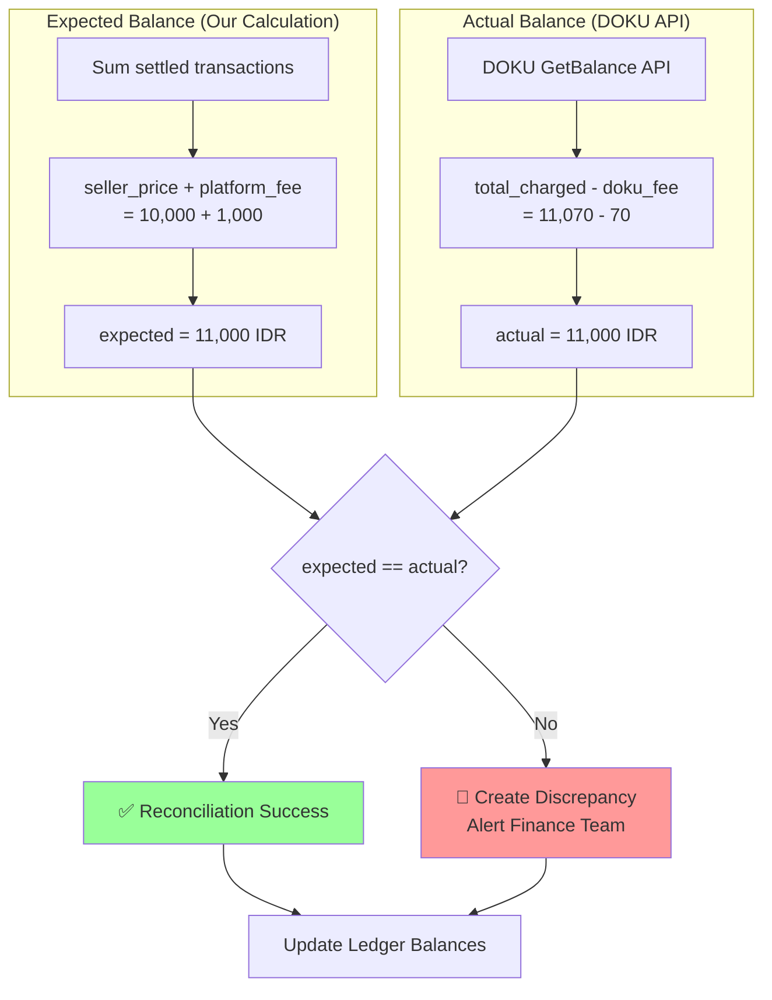
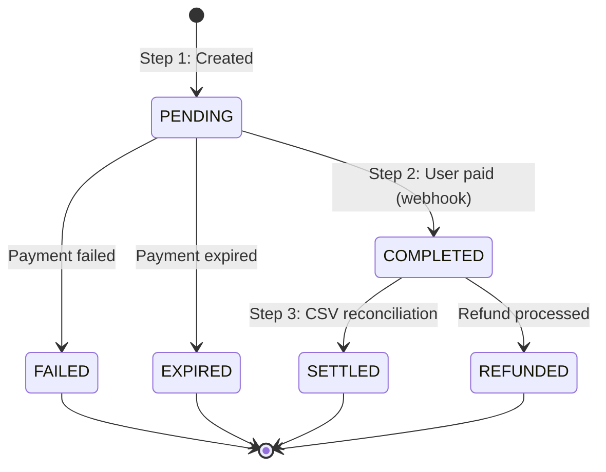
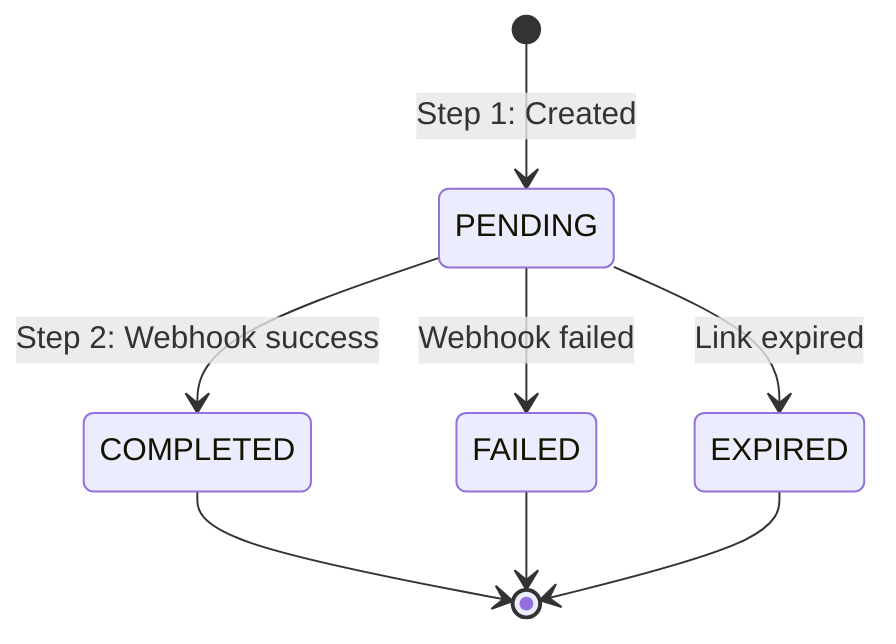
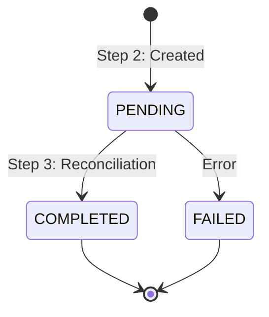
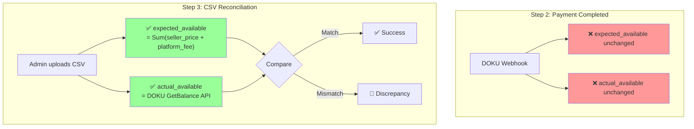

# Payment Flow - Fotafoto Ledger System

Complete payment lifecycle from purchase initiation to settlement reconciliation.

## Entity Roles Overview



## Entity Purposes

| Entity                 | Purpose                                             | Key Fields                                           |
| ---------------------- | --------------------------------------------------- | ---------------------------------------------------- |
| **ProductTransaction** | Business transaction (WHO bought WHAT for HOW MUCH) | invoice_number, seller_price, platform_fee, metadata |
| **payment_requests**   | DOKU payment gateway lifecycle                      | request_id, payment_url, payment_code                |
| **LedgerTransaction**  | Accounting journal entry (audit trail)              | type, reference_type, reference_id                   |
| **Ledgers**            | Seller's wallet balance                             | expected_available, actual_available                 |

## Complete Payment Sequence



## Step 1: Purchase Initiation

### Request

```
POST /api/v1/sales/purchase
{
  "seller_account_id": "seller-123",
  "product_id": "product-456",
  "seller_price": 10000,
  "payment_channel": "QRIS"
}
```

### Fee Calculation



### Database State After Step 1

| Table                | Record                | Status         |
| -------------------- | --------------------- | -------------- |
| product_transactions | tx-123                | **PENDING**    |
| payment_requests     | payment-123           | **PENDING**    |
| Seller's Ledger      | expected_available: 0 | ❌ Not updated |
| Seller's Ledger      | actual_available: 0   | ❌ Not updated |

---

## Step 2: Payment Completed (Webhook)

### DOKU Webhook

```
POST /api/v1/webhook/doku/payment
{
  "request_id": "DOKU-REQ-12345",
  "status": "SUCCESS",
  "amount": 11070
}
```

### What Happens



### Database State After Step 2

| Table                | Record                    | Status               |
| -------------------- | ------------------------- | -------------------- |
| product_transactions | tx-123                    | **COMPLETED** ✅     |
| payment_requests     | payment-123               | **COMPLETED** ✅     |
| ledger_transactions  | CREDIT +10,000            | **PENDING**          |
| Seller's Ledger      | expected_available: **0** | ❌ Still not updated |
| Seller's Ledger      | actual_available: **0**   | ❌ Still not updated |

**Critical**: Payment completion does NOT update balances. Balances are ONLY updated during CSV reconciliation.

---

## Step 3: CSV Reconciliation

### DOKU Settlement CSV Format

```csv
No,MERCHANT NAME,PAYMENT CHANNEL NAME,TRANSACTION DATE,INVOICE NUMBER,CUSTOMER NAME,REPORT CODE,AMOUNT,RECON CODE,FEE,DISCOUNT,PAY TO MERCHANT,PAY OUT DATE,TRANSACTION TYPE,PROMO CODE
1,Mandiri DW,QRIS,14-02-2026,INV-2026-02-15-0001,Customer Name,,11070,,70,0,10000,15-02-2026,Purchase,
```

### Key CSV Fields

| Field               | Value               | Meaning                                         |
| ------------------- | ------------------- | ----------------------------------------------- |
| **INVOICE NUMBER**  | INV-2026-02-15-0001 | Matches `product_transactions.invoice_number`   |
| **AMOUNT**          | 11,070              | seller_price + platform_fee + doku_fee          |
| **FEE**             | 70                  | DOKU's payment gateway fee                      |
| **PAY TO MERCHANT** | 10,000              | What seller receives (seller_price only in CSV) |

### Balance Calculation



### Database State After Step 3

| Table                | Record                         | Status           |
| -------------------- | ------------------------------ | ---------------- |
| product_transactions | tx-123                         | **SETTLED** ✅   |
| payment_requests     | payment-123                    | **COMPLETED** ✅ |
| ledger_transactions  | CREDIT +10,000                 | **COMPLETED** ✅ |
| Seller's Ledger      | expected_available: **11,000** | ✅ Calculated    |
| Seller's Ledger      | actual_available: **11,000**   | ✅ From DOKU API |
| settlement_batches   | batch-456                      | **COMPLETED** ✅ |
| settlement_items     | tx-123 → batch-456             | ✅ Linked        |

---

## Status Lifecycles Summary

### ProductTransaction



### payment_requests



### LedgerTransaction



---

## Balance Update Rules



| Operation                   | expected_available                  | actual_available     |
| --------------------------- | ----------------------------------- | -------------------- |
| Payment (Step 2)            | ❌ NOT updated                      | ❌ NOT updated       |
| CSV Reconciliation (Step 3) | ✅ Sum(seller_price + platform_fee) | ✅ DOKU.GetBalance() |

**Why both should equal:**

- expected = seller_price + platform_fee = 10,000 + 1,000 = 11,000
- actual = total_charged - doku_fee = 11,070 - 70 = 11,000

---

## Key Points

1. **invoice_number** generated immediately when ProductTransaction created
2. **payment_requests** handles DOKU webhook lifecycle
3. **LedgerTransaction** created as PENDING during payment, COMPLETED during reconciliation
4. **Balance updates ONLY during CSV reconciliation** (not during payment)
5. **CSV matching** uses invoice_number to match with DOKU's INVOICE NUMBER field
6. **Discrepancy detection** compares expected (our calculation) vs actual (DOKU API)
