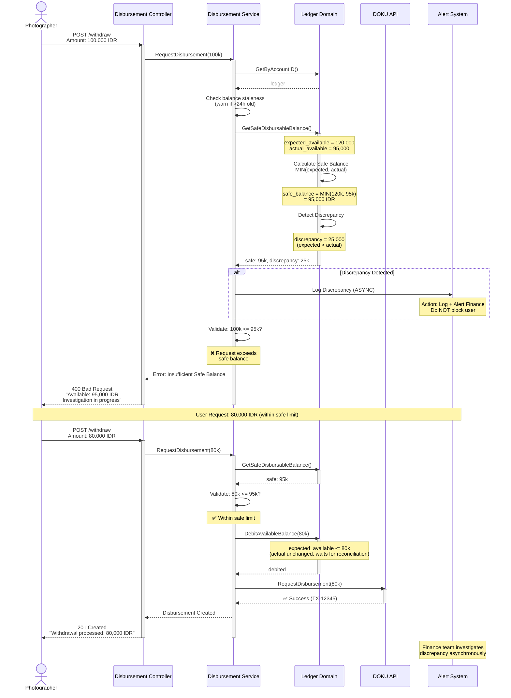

# Safe Disbursement with MIN(Expected, Actual)

```mermaid
sequenceDiagram
    actor User as Photographer
    participant Controller as Disbursement Controller
    participant Service as Disbursement Service
    participant Ledger as Ledger Domain
    participant DOKU as DOKU API
    participant Alert as Alert System

    User->>Controller: POST /withdraw<br/>Amount: 100,000 IDR
    activate Controller

    Controller->>Service: RequestDisbursement(100k)
    activate Service

    Service->>Ledger: GetByAccountID()
    Ledger-->>Service: ledger

    Service->>Service: Check balance staleness<br/>(warn if >24h old)

    Service->>Ledger: GetSafeDisbursableBalance()
    activate Ledger

    Note over Ledger: expected_available = 120,000<br/>actual_available = 95,000

    Ledger->>Ledger: Calculate Safe Balance<br/>MIN(expected, actual)

    Note over Ledger: safe_balance = MIN(120k, 95k)<br/>= 95,000 IDR

    Ledger->>Ledger: Detect Discrepancy
    Note over Ledger: discrepancy = 25,000<br/>(expected > actual)

    Ledger-->>Service: safe: 95k, discrepancy: 25k
    deactivate Ledger

    alt Discrepancy Detected
        Service->>Alert: Log Discrepancy (ASYNC)
        Note over Alert: Action: Log + Alert Finance<br/>Do NOT block user
    end

    Service->>Service: Validate: 100k <= 95k?
    Note over Service: ❌ Request exceeds<br/>safe balance

    Service-->>Controller: Error: Insufficient Safe Balance
    Controller-->>User: 400 Bad Request<br/>"Available: 95,000 IDR<br/>Investigation in progress"

    deactivate Service
    deactivate Controller

    Note over User,Alert: User Request: 80,000 IDR (within safe limit)

    User->>Controller: POST /withdraw<br/>Amount: 80,000 IDR
    activate Controller
    Controller->>Service: RequestDisbursement(80k)
    activate Service

    Service->>Ledger: GetSafeDisbursableBalance()
    activate Ledger
    Ledger-->>Service: safe: 95k
    deactivate Ledger

    Service->>Service: Validate: 80k <= 95k?
    Note over Service: ✅ Within safe limit

    Service->>Ledger: DebitAvailableBalance(80k)
    activate Ledger
    Note over Ledger: expected_available -= 80k<br/>(actual unchanged, waits for reconciliation)
    Ledger-->>Service: debited
    deactivate Ledger

    Service->>DOKU: RequestDisbursement(80k)
    activate DOKU
    DOKU-->>Service: ✅ Success (TX-12345)
    deactivate DOKU

    Service-->>Controller: Disbursement Created
    Controller-->>User: 201 Created<br/>"Withdrawal processed: 80,000 IDR"

    deactivate Service
    deactivate Controller

    Note over Alert: Finance team investigates<br/>discrepancy asynchronously
```
