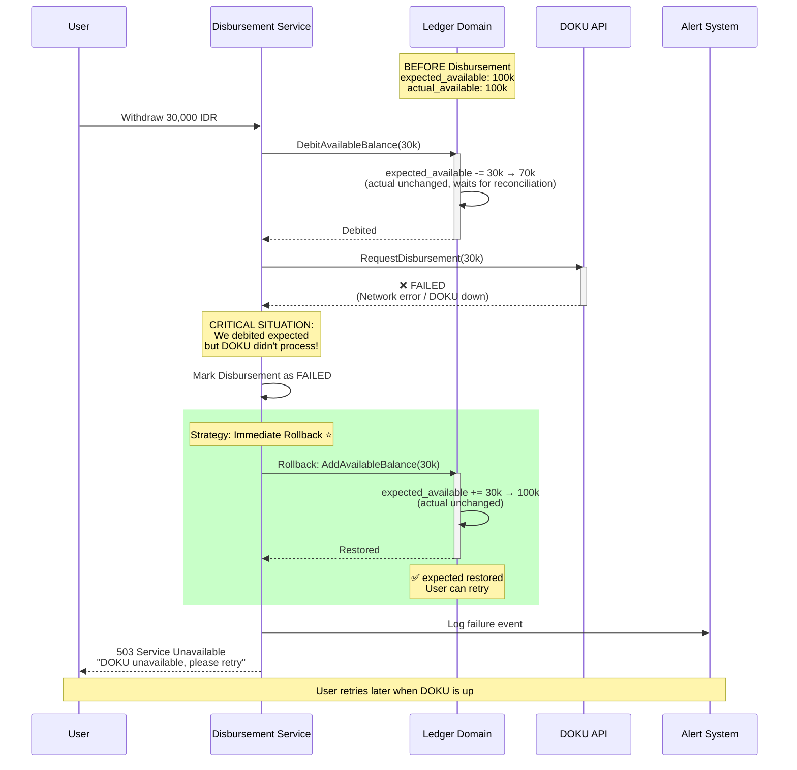

# Edge Case: DOKU Disbursement Failure and Rollback

```mermaid
sequenceDiagram
    participant User
    participant Service as Disbursement Service
    participant Ledger as Ledger Domain
    participant DOKU as DOKU API
    participant Alert as Alert System

    Note over Ledger: BEFORE Disbursement<br/>expected_available: 100k<br/>actual_available: 100k

    User->>Service: Withdraw 30,000 IDR

    Service->>Ledger: DebitAvailableBalance(30k)
    activate Ledger
    Ledger->>Ledger: expected_available -= 30k → 70k<br/>(actual unchanged, waits for reconciliation)
    Ledger-->>Service: Debited
    deactivate Ledger

    Service->>DOKU: RequestDisbursement(30k)
    activate DOKU
    DOKU-->>Service: ❌ FAILED<br/>(Network error / DOKU down)
    deactivate DOKU

    Note over Service: CRITICAL SITUATION:<br/>We debited expected<br/>but DOKU didn't process!

    Service->>Service: Mark Disbursement as FAILED

    rect rgb(200, 255, 200)
        Note over Service: Strategy: Immediate Rollback ⭐
        Service->>Ledger: Rollback: AddAvailableBalance(30k)
        activate Ledger
        Ledger->>Ledger: expected_available += 30k → 100k<br/>(actual unchanged)
        Ledger-->>Service: Restored
        deactivate Ledger
        Note over Ledger: ✅ expected restored<br/>User can retry
    end

    Service->>Alert: Log failure event
    Service-->>User: 503 Service Unavailable<br/>"DOKU unavailable, please retry"

    Note over User,Alert: User retries later when DOKU is up
```
