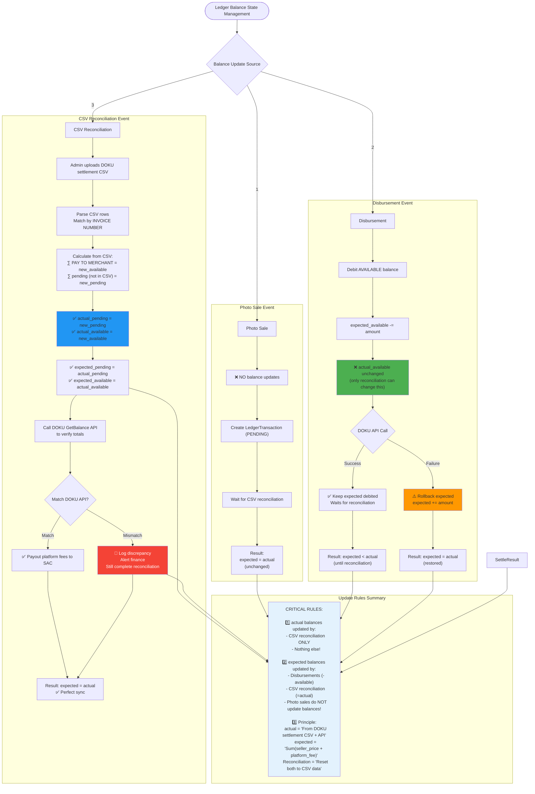

# Complete Balance Update State Management

```mermaid
graph TB
    Start([Ledger Balance State Management]) --> Sources{Balance Update Source}

    Sources -->|1| Sales[Photo Sale]
    Sources -->|2| Disbursement[Disbursement]
    Sources -->|3| Reconciliation[CSV Reconciliation]

    subgraph "Photo Sale Event"
        Sales --> SaleNoUpdate["❌ NO balance updates"]
        SaleNoUpdate --> SaleCreate["Create LedgerTransaction (PENDING)"]
        SaleCreate --> SaleWait["Wait for CSV reconciliation"]
        SaleWait --> SaleResult["Result:<br/>expected = actual<br/>(unchanged)"]
    end

    subgraph "Disbursement Event"
        Disbursement --> DisbDebit["Debit AVAILABLE balance"]
        DisbDebit --> DisbUpdate1["expected_available -= amount"]
        DisbUpdate1 --> DisbUpdate2["❌ actual_available unchanged<br/>(only reconciliation can change this)"]
        DisbUpdate2 --> DisbCall{DOKU API Call}
        DisbCall -->|Success| DisbSuccess["✅ Keep expected debited<br/>Waits for reconciliation"]
        DisbCall -->|Failure| DisbFail["⚠️ Rollback expected<br/>expected += amount"]
        DisbSuccess --> DisbResultOK["Result: expected < actual<br/>(until reconciliation)"]
        DisbFail --> DisbResultFail["Result: expected = actual<br/>(restored)"]
    end

    subgraph "CSV Reconciliation Event"
        Reconciliation --> Upload["Admin uploads DOKU settlement CSV"]
        Upload --> ParseCSV["Parse CSV rows<br/>Match by INVOICE NUMBER"]
        ParseCSV --> CalcBalances["Calculate from CSV:<br/>∑ PAY TO MERCHANT = new_available<br/>∑ pending (not in CSV) = new_pending"]
        CalcBalances --> UpdateActual["✅ actual_pending = new_pending<br/>✅ actual_available = new_available"]
        UpdateActual --> ResetExpected["✅ expected_pending = actual_pending<br/>✅ expected_available = actual_available"]
        ResetExpected --> VerifyDoku["Call DOKU GetBalance API<br/>to verify totals"]
        VerifyDoku --> CompareSync{Match DOKU API?}
        CompareSync -->|Match| PayoutFees["✅ Payout platform fees to SAC"]
        CompareSync -->|Mismatch| LogDiscrepancy["🚨 Log discrepancy<br/>Alert finance<br/>Still complete reconciliation"]
        PayoutFees --> ReconcileResult["Result: expected = actual<br/>✅ Perfect sync"]
        LogDiscrepancy --> ReconcileResult
    end

    subgraph "Update Rules Summary"
        Rules["CRITICAL RULES:<br/><br/>1️⃣ actual balances updated by:<br/>   - CSV reconciliation ONLY<br/>   - Nothing else!<br/><br/>2️⃣ expected balances updated by:<br/>   - Disbursements (-available)<br/>   - CSV reconciliation (=actual)<br/>   - Photo sales do NOT update balances!<br/><br/>3️⃣ Principle:<br/>   actual = 'From DOKU settlement CSV + API'<br/>   expected = 'Sum(seller_price + platform_fee)'<br/>   Reconciliation = 'Reset both to CSV data'"]
    end

    SaleResult --> Rules
    DisbResultOK --> Rules
    DisbResultFail --> Rules
    ResetExpected --> Rules
    LogDiscrepancy --> Rules
    SettleResult --> Rules

    style DisbUpdate2 fill:#4CAF50
    style UpdateActual fill:#2196F3
    style DisbFail fill:#ff9800
    style LogDiscrepancy fill:#f44336,color:#fff
    style Rules fill:#E3F2FD
```
