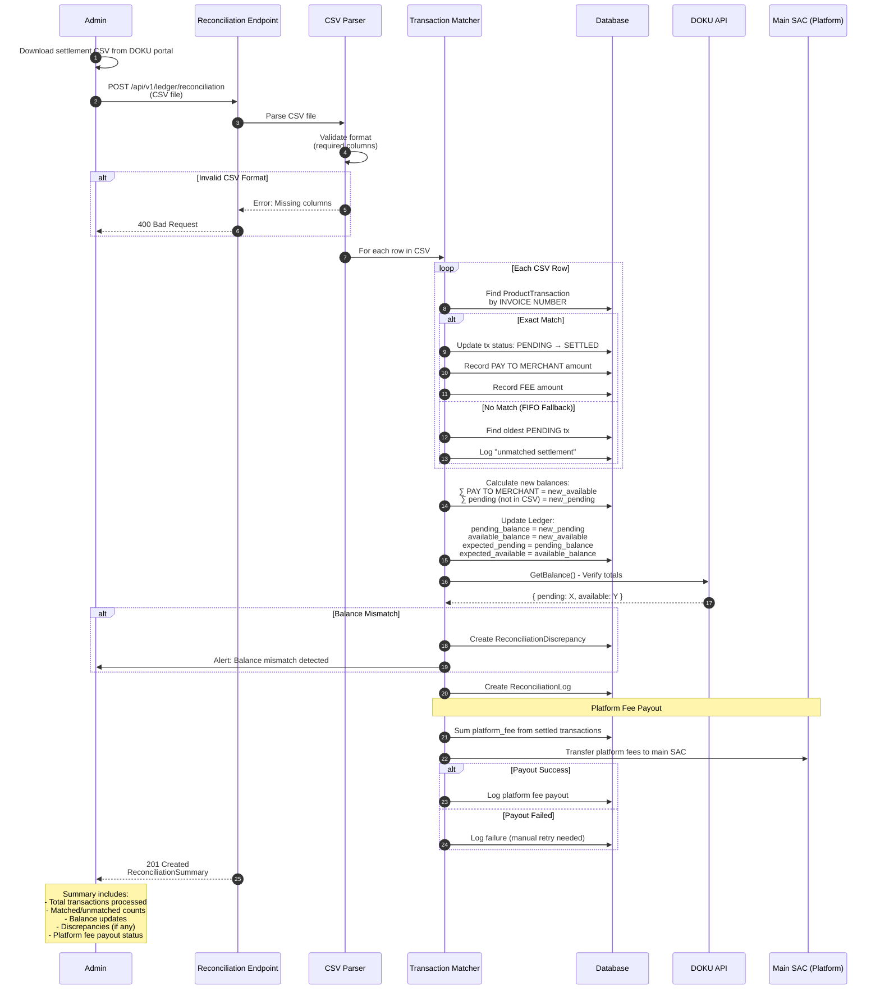

# Reconciliation via CSV Upload

This diagram shows how settlement reconciliation works by uploading DOKU settlement reports.

## Sequence Diagram



## DOKU Settlement CSV Format

```csv
No,MERCHANT NAME,PAYMENT CHANNEL NAME,TRANSACTION DATE,INVOICE NUMBER,CUSTOMER NAME,REPORT CODE,AMOUNT,RECON CODE,FEE,DISCOUNT,PAY TO MERCHANT,PAY OUT DATE,TRANSACTION TYPE,PROMO CODE
1,Mandiri DW,QRIS,08-10-2024,INV_TEST_042,QRIS DOKU,,90000000,,4500,0,20000,08-10-2024,Purchase,
2,Mandiri DW,VA_BCA,08-10-2024,INV_TEST_043,Customer Name,,50000000,,3500,0,15000,08-10-2024,Purchase,
```

### Key Columns

| Column                   | Description                    | Usage                                             |
| ------------------------ | ------------------------------ | ------------------------------------------------- |
| **INVOICE NUMBER**       | Transaction reference          | Match to `product_transactions.id`                |
| **AMOUNT**               | Gross transaction amount       | Compare with `product_transactions.total_charged` |
| **FEE**                  | DOKU payment gateway fee       | Record in settlement records                      |
| **PAY TO MERCHANT**      | Net amount after fees          | Add to photographer's available_balance           |
| **PAY OUT DATE**         | Settlement date                | Track when funds became available                 |
| **PAYMENT CHANNEL NAME** | Payment method (QRIS, VA, etc) | Audit trail                                       |

## Reconciliation Summary Response

```json
{
  "reconciliation_id": "550e8400-e29b-41d4-a716-446655440000",
  "uploaded_by": "admin@fotafoto.com",
  "uploaded_at": "2026-02-15T14:30:00+07:00",
  "settlement_date": "2026-02-15",
  "transactions": {
    "total": 150,
    "matched": 145,
    "unmatched": 5,
    "failed": 0
  },
  "balance_updates": {
    "pending": {
      "before": 1000000,
      "after": 200000,
      "diff": -800000
    },
    "available": {
      "before": 500000,
      "after": 1300000,
      "diff": 800000
    }
  },
  "platform_fees": {
    "total_collected": 50000,
    "payout_status": "SUCCESS",
    "payout_id": "PAYOUT-123"
  },
  "discrepancies": [
    {
      "type": "UNMATCHED_CSV_ENTRY",
      "invoice_number": "INV_UNKNOWN_001",
      "amount": 10000,
      "message": "No matching transaction found in database"
    }
  ],
  "verification": {
    "doku_api_checked": true,
    "doku_pending": 200000,
    "doku_available": 1300000,
    "match_status": "EXACT_MATCH"
  }
}
```

## Flowchart - Reconciliation Steps

```mermaid
flowchart TD
    Start([Admin Upload CSV]) --> Parse[Parse CSV File]

    Parse --> ValidateCSV{Validate Format}
    ValidateCSV -->|Invalid| Err400[400 Bad Request]
    ValidateCSV -->|Valid| Loop[For Each CSV Row]

    Loop --> MatchInvoice{Match by<br/>INVOICE NUMBER?}

    MatchInvoice -->|Exact Match| UpdateTx[Update ProductTransaction:<br/>status = SETTLED]
    MatchInvoice -->|No Match| FIFO[FIFO Fallback:<br/>Oldest PENDING tx]

    FIFO --> LogUnmatched[Log Unmatched Entry]
    LogUnmatched --> UpdateTx

    UpdateTx --> RecordAmounts[Record:<br/>- PAY TO MERCHANT<br/>- FEE<br/>- settlement_batch_id]

    RecordAmounts --> MoreRows{More Rows?}
    MoreRows -->|Yes| Loop
    MoreRows -->|No| CalcBalances[Calculate New Balances:<br/>pending = Σ unsettled<br/>available = Σ PAY TO MERCHANT]

    CalcBalances --> UpdateLedger[Update Ledger:<br/>actual = calculated<br/>expected = actual]

    UpdateLedger --> VerifyDoku[Call DOKU GetBalance API]

    VerifyDoku --> CompareBalances{Balances Match?}

    CompareBalances -->|Yes| CreateLog[Create ReconciliationLog]
    CompareBalances -->|No| LogDiscrepancy[Create ReconciliationDiscrepancy]

    LogDiscrepancy --> CreateLog

    CreateLog --> CalcPlatformFee[Sum platform_fee<br/>from settled transactions]

    CalcPlatformFee --> PayoutSAC[Transfer to Main SAC]

    PayoutSAC --> PayoutSuccess{Payout Success?}

    PayoutSuccess -->|Yes| LogPayout[Log Payout Success]
    PayoutSuccess -->|No| LogPayoutFail[Log Payout Failure<br/>Alert Finance Team]

    LogPayout --> Success[201 Created<br/>Return Summary]
    LogPayoutFail --> Success

    Success --> End([End])
    Err400 --> End

    style ValidateCSV fill:#4FC3F7
    style MatchInvoice fill:#4FC3F7
    style CompareBalances fill:#4FC3F7
    style PayoutSuccess fill:#4FC3F7
    style Success fill:#66BB6A
    style Err400 fill:#f44336,color:#fff
    style LogDiscrepancy fill:#FFA726
    style LogPayoutFail fill:#FF9800
```



## Benefits of This Approach

### 1. **Explicit Control**

- Admin decides when reconciliation happens
- No automatic background jobs needed
- Better for testing and validation

### 2. **Single Source of Truth**

- Settlement CSV from DOKU is authoritative
- No reliance on API polling or webhooks
- Clear audit trail

### 3. **Batch Processing**

- Process entire day's settlements at once
- Efficient database updates
- Single platform fee payout per reconciliation

### 4. **Error Handling**

- Unmatched transactions logged but don't block
- Partial success possible (matched txs still processed)
- Admin can investigate and reprocess if needed

### 5. **Verification**

- Automatic comparison with DOKU API
- Discrepancies logged for investigation
- Finance team alerted without blocking operations

## Edge Cases

### Unmatched CSV Entries

```
CSV has INVOICE_XYZ but our database doesn't
→ Log as "unmatched settlement"
→ Finance team investigates
→ Could be: test transaction, refund, or data sync issue
```

### Missing Transactions

```
Our database has PENDING transactions not in CSV
→ Remains PENDING (will be in next settlement)
→ Expected_pending stays higher than actual_pending
→ Safe balance = MIN(expected, actual) prevents issues
```

### Duplicate Processing

```
Admin uploads same CSV twice
→ Check for duplicate settlement_date
→ 409 Conflict if already processed
→ Admin can re-process with force flag if needed
```

### Platform Fee Payout Failure

```
Transfer to main SAC fails
→ Reconciliation still completes
→ Failure logged with retry metadata
→ Background job retries payout
→ Finance team alerted
```
