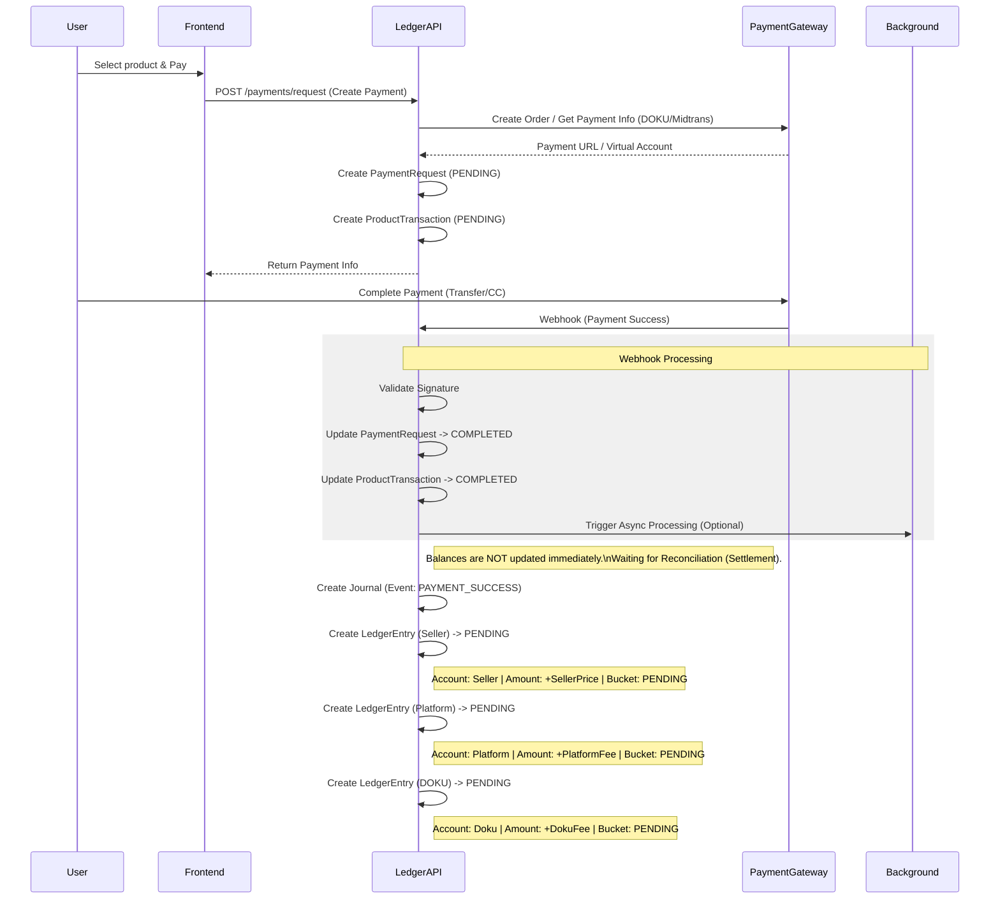

# Payment Execution - Architecture Diagram

This diagram outlines the payment request lifecycle, from creation to completion, interaction with the Payment Gateway (DOKU), and initial ledger recording.

**Key Principles:**

- **ProductTransaction**: Represents the business event (User bought Item X).
- **PaymentRequest**: Represents the financial interaction (User paid Y amount via Channel Z).
- **Ledger Entries Created**:
  - **Journal**: EventType `PAYMENT_SUCCESS`
  - **Seller Entry**: `+SellerPrice` into **PENDING** bucket.
  - **Platform Entry**: `+PlatformFee` into **PENDING** bucket.
  - **Doku Entry**: `+DokuFee` into **PENDING** bucket.
- **Why Pending?**: Funds are held by the payment gateway until settlement. No funds are available for withdrawal yet.
