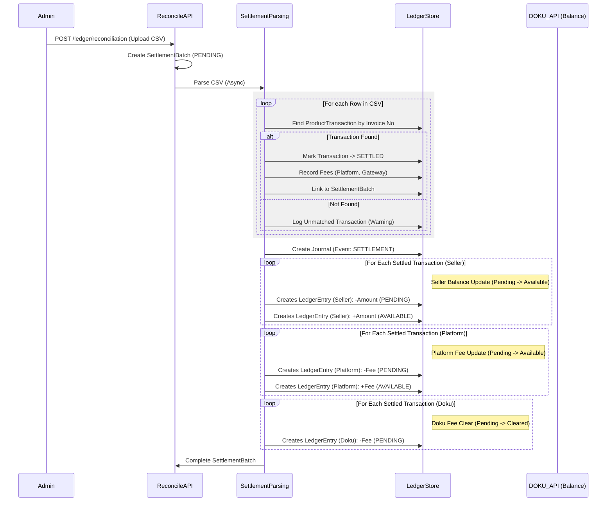

# Settlement & Reconciliation - Architecture Diagram

This diagram details the reconciliation process: processing settlement CSVs from the Payment Gateway (DOKU) to update actual ledger balances.

**Key Concepts:**

- **SettlementBatch**: Represents one CSV file upload.
- **Ledger Entries Created**:
  - **Journal**: EventType `SETTLEMENT`
  - **Seller Entries**:
    - `-Amount` from **PENDING** (removes hold)
    - `+Amount` into **AVAILABLE** (funds ready for withdrawal)
  - **Platform Entries**:
    - `-Fee` from **PENDING**
    - `+Fee` into **AVAILABLE**
  - **Doku Entries**:
    - `-Fee` from **PENDING** (clears liability, Doku keeps the fee)
- **Safe Balance**: `MIN(Expected, Actual)` used for withdrawals.
