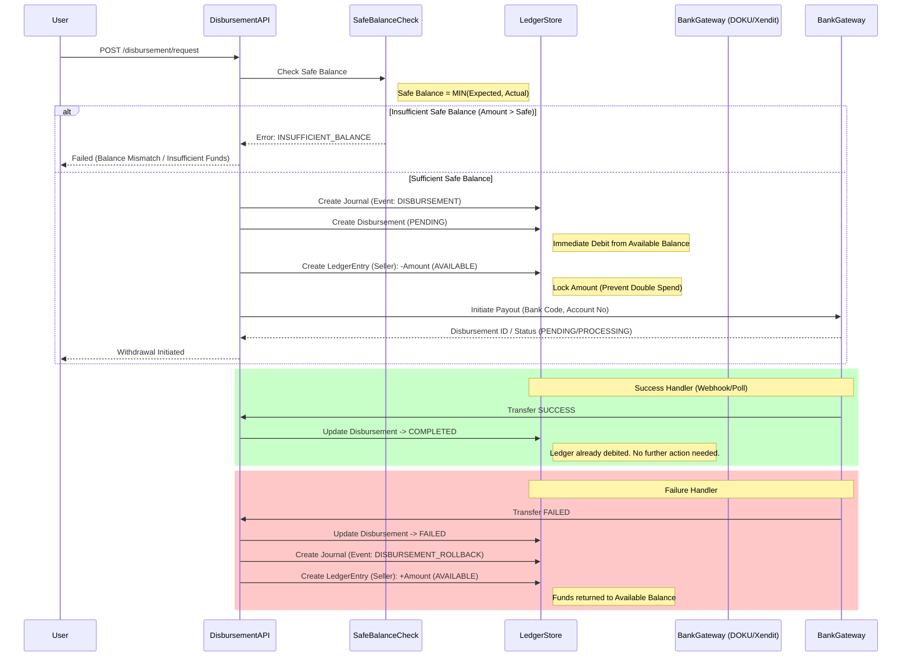

# Withdrawal (Disbursement) - Architecture Diagram

This diagram outlines the process for a user to withdraw their available balance, utilizing the Safe Balance strategy.

**Key Concepts:**

- **Disbursement Request**: Creates a `Journal` (EventType: `DISBURSEMENT`) and debit `LedgerEntry`.
- **Ledger Entries Created**:
  - **Journal**: EventType `DISBURSEMENT`
  - **Seller Entry**: `-Amount` from **AVAILABLE** bucket.
- **Rollback on Failure**:
  - If bank transfer fails, a new `Journal` (EventType: `DISBURSEMENT_ROLLBACK`) is created.
  - **Seller Entry**: `+Amount` into **AVAILABLE** bucket (restores funds).
- **Safe Disbursement Strategy**: Checks `MIN(Expected, Actual)` but debits immediately to prevent double spending.
