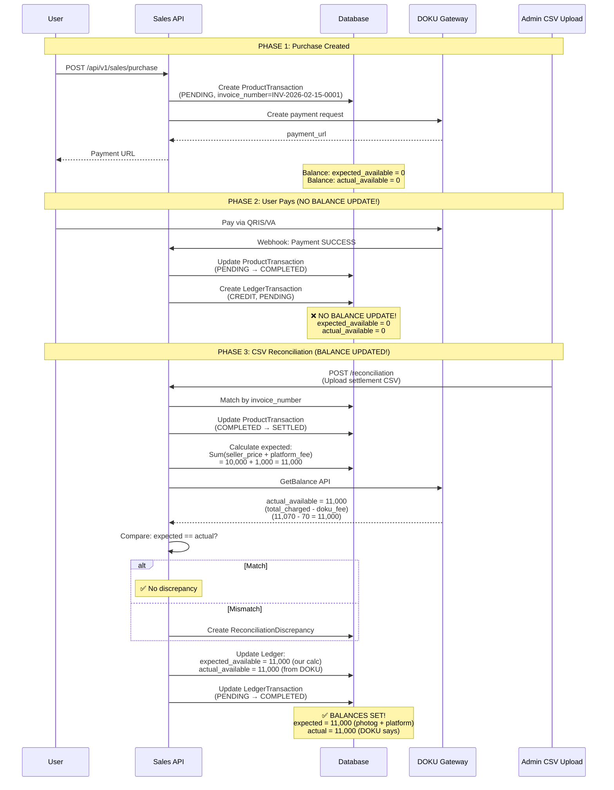

# Balance Update Timing - Corrected Architecture



## Key Points

### ❌ WRONG (Old Architecture)

```
Payment COMPLETED → Credit expected_pending_balance
CSV Reconciliation → Reset expected to match actual
```

### ✅ CORRECT (New Architecture)

```
Payment COMPLETED → NO balance update
CSV Reconciliation → expected_available = Sum(seller_price + platform_fee) from CSV
                     actual_available = DOKU GetBalance API (total_charged - doku_fee)
                     Both equal: seller_price + platform_fee
                     Compare → Create discrepancy if mismatch
```

## Balance Update Rules

| Event                            | expected_available                  | actual_available         |
| -------------------------------- | ----------------------------------- | ------------------------ |
| **ProductTransaction PENDING**   | 🔵 0                                | 🔵 0                     |
| **ProductTransaction COMPLETED** | 🔵 0 (unchanged)                    | 🔵 0 (unchanged)         |
| **ProductTransaction SETTLED**   | 🟢 += (seller_price + platform_fee) | 🟢 = DOKU GetBalance API |
| **Disbursement Requested**       | 🔴 -= amount                        | 🔵 unchanged             |
| **Disbursement Failed**          | 🟢 += amount (rollback)             | 🔵 unchanged             |

## Why This Design?

### Problem

We don't get real-time pending balance data from DOKU. We only get settlement data via CSV.

### Solution

1. **Don't predict** - Don't update expected_available during payment (we'd be guessing)
2. **Wait for authoritative data** - Only update when CSV confirms settlement
3. **Two sources of truth**:
   - `expected_available` = Sum(seller_price + platform_fee) from our settled transactions
   - `actual_available` = DOKU GetBalance API (returns total_charged - doku_fee)
   - Both should equal: seller_price + platform_fee
4. **Compare and detect** - If expected != actual → Create discrepancy record
5. **Safe disbursement** - Use MIN(expected, actual) for withdrawals

### Benefits

- **Dual verification**: Our calculation vs DOKU's authoritative balance
- **Automatic discrepancy detection**: Know immediately if there's a mismatch
- **Safe operations**: MIN ensures we never overdraw
- **Clear audit trail**: Can trace every balance change back to transactions

### Example

```
Transaction:
- Seller price: 10,000 IDR
- Platform fee: 1,000 IDR
- DOKU fee: 70 IDR
- Total charged: 11,070 IDR

After Settlement:
- expected_available = 10,000 + 1,000 = 11,000 IDR (our calculation)
- actual_available = 11,070 - 70 = 11,000 IDR (DOKU GetBalance API)
- Match ✅ No discrepancy
```
