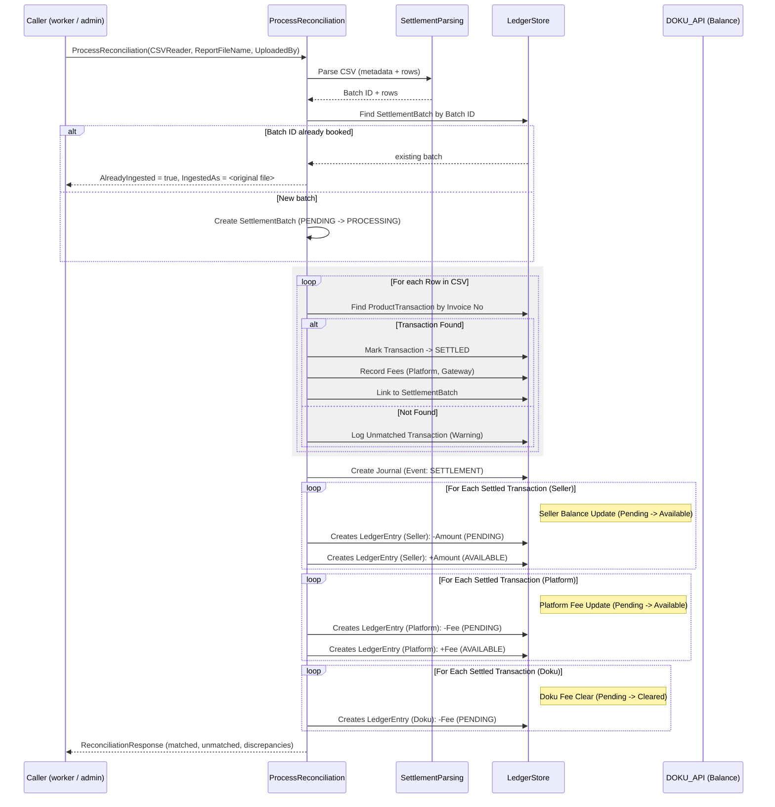

# Settlement & Reconciliation - Architecture Diagram

This diagram details the reconciliation process: processing settlement CSVs from the Payment Gateway (DOKU) to update actual ledger balances.

## How a CSV reaches this package

`ProcessReconciliation` takes an `io.Reader`, not a path or a bucket key. Where the CSV came
from is the caller's business, and deliberately so — this package knows about ledgers, not
about object storage.

In production the caller is a **background worker**, not an admin upload. Each tick it lists
the settlement bucket, asks `FilterIngestedReportFiles` which of those keys are already
booked, and hands over the rest. It calls with `UploadedBy: "System"`, passes the full object
key as `ReportFileName` (unique where a bare filename is not), and leaves `SettlementDate`
zero so that this package falls back to the `PayOutDate` of the first CSV row — the file's
real settlement date, rather than the date the worker happened to run.

An admin upload is still a perfectly valid caller; it is simply no longer the only one, and
no longer the one that runs every day.

## Ingestion is idempotent

A settlement batch is booked **at most once**, keyed on DOKU's own `Batch ID` from the CSV
metadata header. Presenting the same CSV again — under the same name or a different one —
returns `AlreadyIngested: true` with `IngestedAs` naming the file it was first booked under,
and posts nothing.

This matters because a caller that discovers files by listing a bucket will meet the same
file repeatedly, and because ledger entries are immutable: a double-post cannot be deleted,
only corrected with compensating entries.

There are two brakes, and both are needed:

| Brake | Where | Catches |
|---|---|---|
| `batch_id` check before any write | `ProcessReconciliation` | the ordinary repeat — answered quietly, no error |
| partial `UNIQUE` index on `batch_id` | migration `013` | the race between two concurrent callers, and any path that skips the check |

`IngestedAs` is returned rather than a bare boolean so the caller can distinguish a benign
re-ship (same file, new key) from a *different* file carrying a `batch_id` already booked —
which is also what a DOKU correction would look like, and should not be swallowed quietly.

**Key Concepts:**

- **SettlementBatch**: Represents one ingested settlement CSV, identified by DOKU's `Batch ID`.
- **Ledger Entries Created**:
  - **Journal**: EventType `SETTLEMENT`
  - **Seller Entries**:
    - `-Amount` from **PENDING** (removes hold)
    - `+Amount` into **AVAILABLE** (funds ready for withdrawal)
  - **Platform Entries**:
    - `-Fee` from **PENDING**
    - `+Fee` into **AVAILABLE**
  - **Doku Entries**:
    - `-Fee` from **PENDING** (clears liability, Doku keeps the fee)
- **Safe Balance**: `MIN(Expected, Actual)` used for withdrawals.

**Related:**

- `database/migrations/013_settlement_batches_idempotency.sql` — the two indexes ingestion
  relies on, and why one of them is unique.
